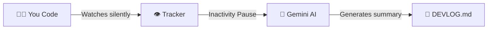
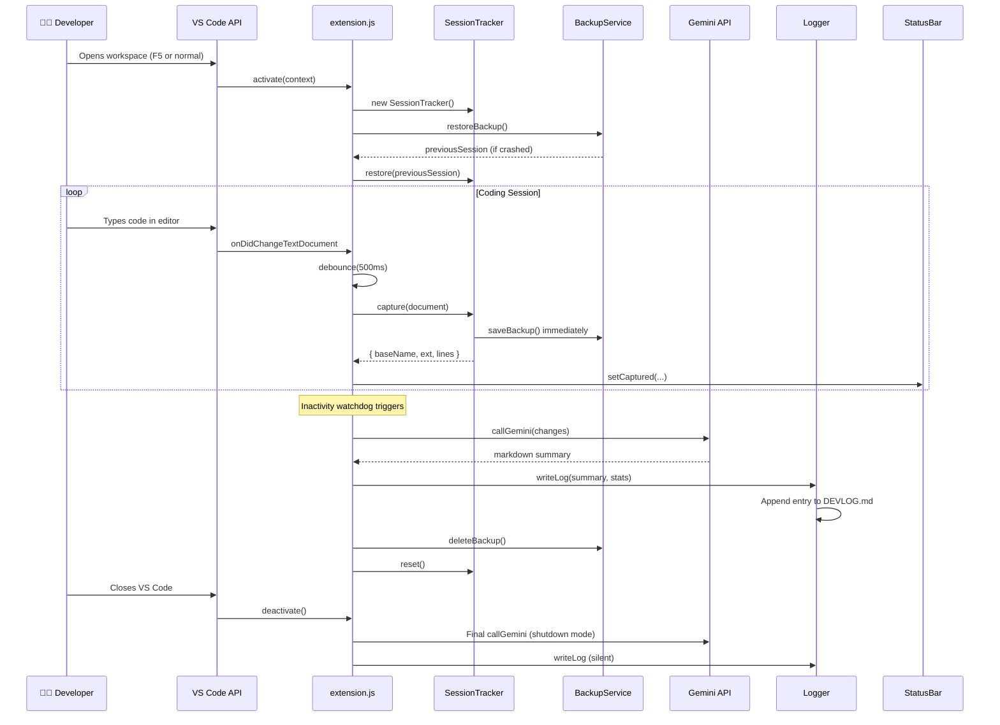
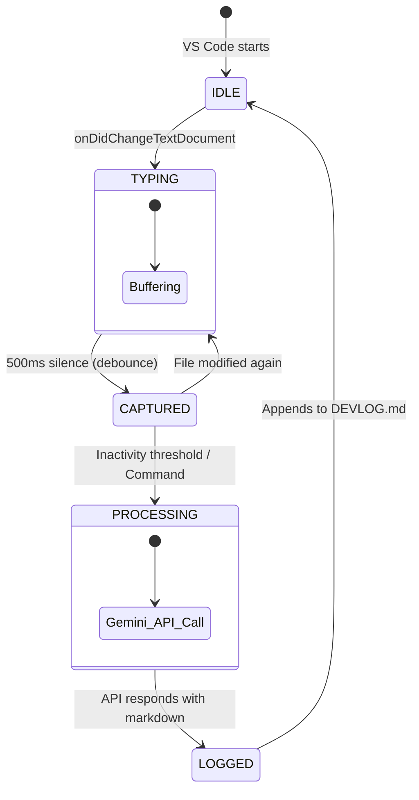
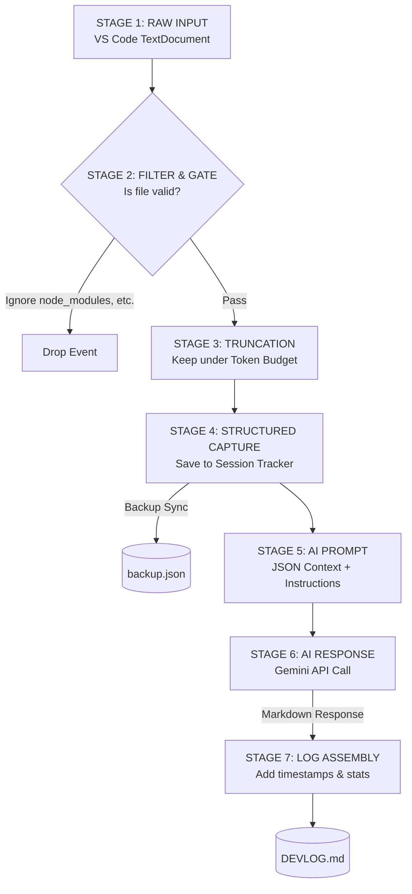

<div align="center">


<br/>

[](https://github.com/VRAJESH-31)
[](https://www.linkedin.com/in/vrajesh-n-pandya-a8ba25266/)
[](https://vrajesh-31.vercel.app/)

<br/>
<br/>

# 🤖 Auto-DevLog

### *Your AI-Powered Developer Journal — Zero Effort. Maximum Insight.*

> **Stop wasting time writing dev logs. Let your code speak for itself.**

Auto-DevLog is a VS Code extension that **silently watches your keystrokes**, understands your work in real-time, and uses **Google Gemini AI** to generate beautiful, professional developer logs — completely automatically. No commands, no interruptions, no friction.

<br/>

[**📦 Install Extension**](#-installation) · [**🚀 Quick Start**](#-quick-start) · [**🏗️ Architecture**](#️-system-architecture) · [**🗺️ Roadmap**](#️-roadmap)

<br/>

---

</div>

## Overview

### 🧩 The Problem Nobody Talks About

Every developer knows they *should* keep a dev log. Managers want them. Standups need them. Future-you desperately needs them. Yet almost nobody actually does it consistently.

**Why?**

Because writing a dev log feels like doing *homework after school*. You just finished a 4-hour debugging session — the last thing you want to do is write a paragraph about it. So you skip it. Again. And again.

```
Day 1:  "I'll write it tomorrow"
Day 3:  "I forgot what I even did"
Day 7:  "What did I build last week again?"
Sprint Review: "Uh... I fixed some bugs and added a feature?"
```

This isn't a discipline problem. **It's a tooling problem.**

---

### 💡 The Solution: Auto-DevLog

Auto-DevLog eliminates the *act* of writing logs entirely. It runs silently in the background, captures your work as you code, and when you pause — it calls Google Gemini AI to generate a structured, intelligent summary of your session.

**The result?** A beautiful `DEVLOG.md` in your workspace that tracks everything you've done, *automatically*, written in professional developer language.

```
You code → We watch → AI summarizes → Log written ✅
```

> **Nothing like this exists as a native VS Code experience.** Time trackers like WakaTime tell you *how long* you coded. Auto-DevLog tells you *what you built and why*.

---

### ✨ Features at a Glance

| Feature | Description |
|---|---|
| 🔍 **Silent Watching** | Monitors all file changes in your workspace with zero interruption |
| 🧠 **AI Summarization** | Google Gemini Flash analyzes your changes and writes intelligent logs |
| ⚡ **Auto-Commit** | Automatically logs sessions after inactivity — no manual action needed |
| 📊 **Live Dashboard** | Beautiful webview showing session stats, files modified, and duration |
| 🛡️ **Crash Recovery** | Every session is backed up immediately — zero data loss even on crash |
| 🎯 **Smart Filtering** | Automatically ignores `node_modules`, `.git`, build artifacts, and binaries |
| 📈 **Status Bar** | Real-time status bar showing current capture state and file count |
| ✏️ **Manual Control** | Force-generate a log anytime with `DevLog: Stop Session & Generate Log` |
| 📝 **Markdown Native** | All logs written as structured, timestamped Markdown entries |
| 📦 **DEVLOG.md** | Single, append-only log file grows with your project over time |

---

## Tech Stack

<div align="center">

### ⚙️ Built with Native VS Code APIs and Google AI

</div>

<br/>

<table>
<tr>
<td width="50%" valign="top">

### 🧠 **AI & Core Platform**

<table>
<tr>
<td width="40%"><b>Technology</b></td>
<td width="60%"><b>Purpose</b></td>
</tr>
<tr>
<td> <b>Gemini API</b></td>
<td>AI Language model for dev log generation</td>
</tr>
<tr>
<td> <b>VS Code Ext API</b></td>
<td>Native bindings for editor state</td>
</tr>
<tr>
<td> <b>Node.js</b></td>
<td>Underlying runtime environment</td>
</tr>
</table>

</td>
<td width="50%" valign="top">

### 🎨 **Logic & UI Layer**

<table>
<tr>
<td width="40%"><b>Technology</b></td>
<td width="60%"><b>Purpose</b></td>
</tr>
<tr>
<td> <b>JS (ES6+)</b></td>
<td>Core application architecture</td>
</tr>
<tr>
<td> <b>HTML/CSS/JS</b></td>
<td>Interactive native Webview dashboard</td>
</tr>
</table>

</td>
</tr>
</table>

---

## Architecture

Auto-DevLog follows a **modular, service-oriented architecture** — built deliberately to study system design patterns: separation of concerns, event-driven pipelines, crash-safe state management, and clean service boundaries.

### 📁 Project Structure

```
auto-devlog/
├── src/
│   ├── extension.js          # 🎯 Entry point — VS Code lifecycle, event wiring
│   │
│   ├── config/
│   │   └── index.js          # ⚙️  Central config — loads .env, exports defaults
│   │
│   ├── services/             # 🧠 Core business logic (no VS Code coupling)
│   │   ├── tracker.js        # 📡 Session state machine — captures & stats
│   │   ├── gemini.js         # 🤖 AI bridge — prompt engineering + API call
│   │   ├── logger.js         # 📝 Log writer — append-only DEVLOG.md
│   │   └── backup.js         # 🛡️  Crash guard — synchronous persist/restore
│   │
│   ├── ui/                   # 🎨 Presentation layer (VS Code webview)
│   │   ├── statusBar.js      # 📊 Real-time state indicator in status bar
│   │   ├── dashboard.js      # 🖥️  Webview controller & message bridge
│   │   └── templates/
│   │       └── dashboard.html # HTML/CSS/JS — self-contained webview panel
│   │
│   └── utils/                # 🔧 Pure helpers (stateless, reusable)
│       ├── fileHelpers.js    # Ignore lists, extension detection, icon map
│       └── truncate.js       # Smart token-budget truncation
│
├── .env                      # 🔑 Runtime secrets & tunables
├── package.json              # 📦 VS Code extension manifest
└── DEVLOG.md                 # 🗒️  Generated developer journal (append-only)
```

### 🔗 Component Dependency Map

```
╔══════════════════════════════════════════════════════════════╗
║                      extension.js                          ║
║          (VS Code API adapter — the only place             ║
║           that imports from 'vscode' directly)             ║
╚═══════════╤══════════╤══════════╤═══════════╤══════════════╝
            │          │          │           │
            ▼          ▼          ▼           ▼
       ┌─────────┐ ┌────────┐ ┌───────┐ ┌────────┐
       │ config  │ │tracker │ │gemini │ │ logger │
       │ /index  │ │  .js   │ │  .js  │ │  .js   │
       └────┬────┘ └───┬────┘ └───────┘ └────────┘
            │           │
            ▼           ▼
       ┌─────────┐ ┌──────────┐ ┌──────────┐
       │  .env   │ │  backup  │ │truncate  │
       │ secrets │ │   .js    │ │fileHelper│
       └─────────┘ └──────────┘ └──────────┘

       ┌─────────────────────────────────────┐
       │         UI Layer (Webview)          │
       │  statusBar.js  →  dashboard.js      │
       │                   → dashboard.html  │
       └─────────────────────────────────────┘
```

> **Design Decision**: `extension.js` is the *only* module that imports from `vscode`. All services are plain Node.js — this makes them independently testable and portable to other editors.

---

## Workflow

### 🎬 How It Works — The Magic Explained



---

### 🔄 Event Flow & Lifecycle

### Full Session Lifecycle



### Trigger Sources

The extension generates logs from three different triggers:

```
┌─────────────────────────────────────────────────────────────┐
│                   LOG GENERATION TRIGGERS                   │
├─────────────────┬───────────────────┬───────────────────────┤
│  🕐 AUTO        │  ✋ MANUAL        │  🔴 SHUTDOWN          │
├─────────────────┼───────────────────┼───────────────────────┤
│ Inactivity >    │ User runs command │ VS Code window        │
│ threshold (5m   │ "DevLog: Stop     │ closes / crashes      │
│ default)        │ Session & Gen..."  │                       │
├─────────────────┼───────────────────┼───────────────────────┤
│ Shows progress  │ Shows progress    │ Silent save mode      │
│ notification    │ notification      │ (no UI available)     │
├─────────────────┼───────────────────┼───────────────────────┤
│ "Inactivity     │ "Entry created    │ Backup already        │
│ detected.       │ successfully!"    │ preserved as          │
│ Session logged!"│                   │ fallback              │
└─────────────────┴───────────────────┴───────────────────────┘
```

---

### 🔁 Extension State Machine

At runtime, the extension behaves as a finite state machine — every user action or timer event transitions it from one state to another.



| State | Trigger In | Status Bar Shows |
|---|---|---|
| **IDLE** | Session reset / startup | `$(eye) DevLog Watching` |
| **TYPING** | `onDidChangeTextDocument` | `$(pencil) DevLog Typing...` |
| **CAPTURED** | Debounce fires | `$(file-code) filename.js [N files]` |
| **PROCESSING** | Inactivity / manual / shutdown | `$(sync~spin) DevLog Processing` |
| **LOGGED** | Gemini responds | Notification shown → reset to IDLE |

---

### 🔀 Data Transformation Pipeline

Every keystroke goes through a series of transformations before becoming a formatted log entry. This pipeline shows exactly how raw file content becomes a polished developer log:



---

## Technical Deep-Dive

### 🧠 AI Summarization — How It Thinks

The Gemini prompt is engineered to produce structured, professional dev logs — not vague summaries.

### What Gets Sent to Gemini

```javascript
// Each captured change is sent as structured JSON
{
  "file": "tracker.js",
  "type": ".js",
  "lines": 110,
  "timestamp": "2026-02-21T00:09:16.000Z",
  "truncated": false,
  "preview": "class SessionTracker { constructor() { this.reset(); }..."
}
```

### System Prompt Philosophy

The AI is instructed to:
- **Identify the main objective** of the session
- **Connect relationships** between files (e.g., API change → UI update)
- **Use conventional commit prefixes** (`feat:`, `fix:`, `refactor:`)
- **Categorize changes** into Features, Bug Fixes, Refactoring
- **Ignore noise** — temporary debug lines, whitespace, indentation changes
- **Be technical but readable** — like a senior dev wrote it

### Sample Generated Log Output

```markdown
---

## 📝 Log: Saturday, February 21, 2026 at 12:09 AM

**Session Stats:** 14 captures across 4 files

### 🎯 Session Objective
Refactored the session management layer and added crash-recovery
backup system to ensure zero data loss across VS Code restarts.

### ✨ Features Added
- **feat(tracker):** Introduced `SessionTracker` class to encapsulate
  session state — changes array, stats, and activity timestamps.
- **feat(backup):** Implemented automatic backup-on-capture pattern;
  every file change is persisted immediately to prevent data loss.

### 🔧 Refactoring
- **refactor(extension):** Extracted service initialization into
  dedicated modules (`tracker.js`, `backup.js`) for cleaner separation
  of concerns and easier unit testing.

### 📁 Files Modified
| File | Lines | Changes |
|------|-------|---------|
| `tracker.js` | 110 | Core session management class |
| `backup.js` | 85 | Crash recovery system |
| `extension.js` | 200 | Wired new services into lifecycle |
| `config/index.js` | 90 | Added backup config constants |

*Generated by Auto-DevLog*
```

---

### 🛡️ Crash Recovery System

One of Auto-DevLog's most important features is its **zero-data-loss guarantee**.

```
File Changed → Tracker.capture() → saveBackup() ← immediate!
                                         │
                                   backup.json
                                   (workspace root)

Next VS Code launch:
   activate() → restoreBackup() → session restored before you type a word
```

The backup file is written **synchronously on every capture**, meaning even if VS Code crashes mid-session, your entire work history is preserved and automatically restored on next launch.

---

## ⚙️ Configuration Reference

All tunables live in your `.env` file in the project root.

```bash
# .env — Auto-DevLog Configuration

# ─────────────────────────────────────────
# REQUIRED: Your Google Gemini API Key
# Get yours at: https://aistudio.google.com/apikey
# ─────────────────────────────────────────
GEMINI_API_KEY=your_api_key_here

# ─────────────────────────────────────────
# TIMING & PERFORMANCE
# ─────────────────────────────────────────

# How long to wait after last keystroke before capturing (ms)
# Lower = more captures, higher = more batching
DEBOUNCE_DELAY=500

# How long of inactivity before auto-logging (ms)
# Default: 5 minutes (300000)
INACTIVITY_THRESHOLD=300000

# How often to check for inactivity (ms)
# Default: 30 seconds
INACTIVITY_CHECK_INTERVAL=30000

# Gemini API request timeout (ms)
API_TIMEOUT=30000

# ─────────────────────────────────────────
# CONTENT & OUTPUT
# ─────────────────────────────────────────

# Max characters of file content to send to AI (token budget)
MAX_CONTENT_LENGTH=10000

# Output log filename (relative to workspace root)
LOG_FILENAME=DEVLOG.md
```

### Configuration Defaults

| Variable | Default | Description |
|---|---|---|
| `DEBOUNCE_DELAY` | `500ms` | Keystroke buffer wait time |
| `INACTIVITY_THRESHOLD` | `300000ms` | 5 minutes of silence = auto-log |
| `INACTIVITY_CHECK_INTERVAL` | `30000ms` | Check every 30 seconds |
| `API_TIMEOUT` | `30000ms` | Gemini request timeout |
| `MAX_CONTENT_LENGTH` | `10000 chars` | Token budget per session |
| `LOG_FILENAME` | `DEVLOG.md` | Output file name |

---

## 📦 Installation

### Option 1: From Source (Development)

```bash
# 1. Clone the repository
git clone https://github.com/YOUR_USERNAME/auto-devlog.git
cd auto-devlog

# 2. Install dependencies
npm install

# 3. Configure your API key
cp .env.example .env
# Edit .env and add your GEMINI_API_KEY

# 4. Open in VS Code
code .

# 5. Press F5 to launch Extension Development Host
```

### Option 2: Package & Install (VSIX)

```bash
# Install the VSIX packaging tool
npm install -g @vscode/vsce

# Package the extension
vsce package

# Install in VS Code
code --install-extension auto-devlog-0.0.1.vsix
```

### Prerequisites

| Requirement | Version |
|---|---|
| VS Code | `^1.104.0` |
| Node.js | `18.x` or higher |
| Google Gemini API Key | Free tier sufficient |

---

## 🚀 Quick Start

### Step 1 — Get Your API Key

1. Visit [Google AI Studio](https://aistudio.google.com/apikey)
2. Create a new API key (free)
3. Copy the key

### Step 2 — Configure

```bash
# Create .env from example
cp .env.example .env

# Open .env and replace placeholder
GEMINI_API_KEY=AIzaSy...your_actual_key_here
```

### Step 3 — Launch

Press **F5** in VS Code to launch the Extension Development Host.

You'll see in the status bar:
```
$(eye) DevLog Watching
```

### Step 4 — Code Normally

Just write code. The extension watches silently. After a pause in coding, you'll see a progress notification:

```
DevLog: Inactivity detected. Generating log...  [████████░░] 70%
```

### Step 5 — Check Your Log

Open `DEVLOG.md` in your workspace. A new entry has been automatically appended. 🎉

---

## 🎮 Commands

Access via **Command Palette** (`Ctrl+Shift+P`):

| Command | Description |
|---|---|
| `DevLog: Show Session Stats` | Opens the live webview dashboard panel |
| `DevLog: Stop Session & Generate Log` | Manually triggers AI summarization now |

### Status Bar States

```
$(eye) DevLog Watching           ← Idle, monitoring for changes
$(pencil) DevLog Typing...       ← Debounce active, you're typing
$(file-code) main.js [3 files]   ← File captured, showing last modified
$(sync~spin) DevLog Processing   ← Calling Gemini API
```

---

## 📊 The Dashboard

Click the status bar item or run `DevLog: Show Session Stats` to open the live dashboard.

```
┌────────────────────────────────────────────────────────────────┐
│  🤖 DevLog Dashboard                              [⟳ Refresh] │
├──────────────┬─────────────────┬───────────────────────────────┤
│  Session     │   Files         │   Captures                    │
│  Duration    │   Modified      │   This Session                │
│  ── 42m ──  │   ─── 7 ────   │   ────── 24 ───────           │
├──────────────┴─────────────────┴───────────────────────────────┤
│  📁 Files Captured                                             │
│  ┌──────────────────────────────────────────────────────────┐ │
│  │  📄 extension.js        ·  200 lines  ·  6 captures     │ │
│  │  📄 tracker.js          ·  110 lines  ·  4 captures     │ │
│  │  📄 gemini.js           ·   77 lines  ·  3 captures     │ │
│  │  📄 dashboard.html      ·  307 lines  ·  7 captures     │ │
│  │  📄 statusBar.js        ·  129 lines  ·  2 captures     │ │
│  └──────────────────────────────────────────────────────────┘ │
│                                                                │
│           [🛑 Stop & Generate Log Now]                        │
└────────────────────────────────────────────────────────────────┘
```

---

## 🗂️ Smart File Filtering

Auto-DevLog is intelligent about what it logs. It automatically ignores:

```javascript
// Ignored patterns (never logged)
const IGNORED_EXTENSIONS = [
  '.png', '.jpg', '.gif', '.svg', '.ico',  // Images
  '.ttf', '.woff', '.woff2', '.eot',       // Fonts
  '.mp4', '.mp3', '.wav',                  // Media
  '.zip', '.tar', '.gz',                   // Archives
  '.vsix', '.exe', '.dll',                 // Binaries
  '.d.ts',                                 // Type declarations
];

const IGNORED_PATHS = [
  'node_modules', '.git', 'dist', 'build',  // Build artifacts
  '.vscode', 'coverage', '__pycache__',     // Tooling dirs
  'backup.json',                            // Our own backup file
];
```

---

## 🔬 Technical Deep-Dive

### Debounce Architecture

The change listener uses a timer-cancel pattern to batch rapid keystrokes:

```
Keystrokes:  A  B  C  D  [pause 500ms]  E  F  [pause 500ms]
Captures:   ─────────────────────────────►◉────────────────►◉
                   (only 2 captures, not 6!)
```

This prevents API flooding and groups logically related changes.

### Smart Truncation

Large files are truncated intelligently before sending to Gemini to respect token limits:

```javascript
// Keeps content within token budget
// Prioritizes: file header + first N% of content
// Marks truncated sections clearly for AI context
function smartTruncate(content, maxLength = CONFIG.MAX_CONTENT_LENGTH) {
  if (content.length <= maxLength) return content;
  return content.substring(0, maxLength) + '\n... [truncated]';
}
```

### Graceful Shutdown

When VS Code closes, the extension enters **shutdown mode** — it bypasses all UI, calls Gemini silently, writes the log, and exits cleanly:

```javascript
async function deactivate() {
  isShuttingDown = true;           // 1. Signal shutdown mode
  clearTimeout(typingTimer);       // 2. Cancel pending timers
  clearInterval(inactivityInterval);
  
  if (tracker?.hasData()) {
    await processLogSession('shutdown');  // 3. Silent final save
  }
  
  statusBar?.dispose();            // 4. Clean up VS Code resources
}
```

---

## 🆚 How We Compare

| Feature | Auto-DevLog | WakaTime | CodeTime | Manual Diary |
|---|:---:|:---:|:---:|:---:|
| **Zero configuration** | ✅ | ✅ | ✅ | ✅ |
| **AI-Generated summaries** | ✅ | ❌ | ❌ | ❌ |
| **What you built, not just time** | ✅ | ❌ | ❌ | ✅ |
| **Fully offline / local** | ✅ | ❌ | ❌ | ✅ |
| **No account required** | ✅ | ❌ | ❌ | ✅ |
| **Markdown output** | ✅ | ❌ | ❌ | 🔶 |
| **Crash recovery** | ✅ | — | — | ❌ |
| **Open source** | ✅ | ❌ | ✅ | ✅ |
| **Free forever (self-host)** | ✅ | 🔶 | 🔶 | ✅ |

> **The key differentiator**: WakaTime and CodeTime tell you *how many hours* you coded. Auto-DevLog tells you *what you built, what you fixed, and why* — in the language of a senior developer.

---

## 📁 Output Format

Auto-DevLog creates and maintains a single `DEVLOG.md` file. Here's what it looks like after a few sessions:

```markdown
# Developer Log

Automated development journal powered by Auto-DevLog.

---

## 📝 Log: Friday, February 20, 2026 at 11:45 PM

**Session Stats:** 8 captures across 3 files

### 🎯 Session Objective
Added crash recovery backup system and integrated it with the 
session tracker for zero-data-loss guarantee.

### ✨ Features Added
- **feat(backup):** New `BackupService` with saveBackup/restoreBackup/deleteBackup
- **feat(tracker):** SessionTracker now calls saveBackup() on every capture

### 📁 Files Modified
| File | Lines |
|------|-------|
| `backup.js` | 85 |
| `tracker.js` | 110 |
| `extension.js` | 180 |

*Generated by Auto-DevLog*

---

## 📝 Log: Saturday, February 21, 2026 at 12:09 AM

**Session Stats:** 5 captures across 2 files

### 🎯 Session Objective  
Dashboard webview implementation — live session stats panel.

### ✨ Features Added
- **feat(ui):** DashboardManager webview with real-time stats
- **feat(ui):** HTML template with responsive layout and dark theme

*Generated by Auto-DevLog*
```

---

## 🗺️ Roadmap

**v1.0 — shipped ✅**

| Done | Feature |
|:---:|---|
| ✅ | Real-time file change monitoring |
| ✅ | Debounced capture engine |
| ✅ | Gemini AI summarization |
| ✅ | Auto-log on inactivity + manual trigger |
| ✅ | Crash recovery backup system |
| ✅ | Live session dashboard (webview) |
| ✅ | Smart file filtering |
| ✅ | Status bar + graceful shutdown save |

**Coming up:**

- `v1.1` — Custom output templates, per-project config, dashboard export
- `v1.2` — Unit test coverage, retry backoff, incremental scanning
- `v1.3` — Multi-model AI (OpenAI, Claude, Ollama)
- `v2.0` — Team collaboration, natural language queries, mobile companion

---

## 🔐 Security & Privacy

Auto-DevLog is designed privacy-first:

- **API Key is local**: Your Gemini key lives only in your `.env` file — never transmitted anywhere except directly to Google's API
- **No telemetry**: Zero usage tracking, analytics, or phone-home behavior
- **Source is open**: Every line of this extension runs on your machine and you can inspect exactly what it does
- **Content truncation**: Only the first `MAX_CONTENT_LENGTH` characters of each file are sent to Gemini — never your full secrets or codebase
- **`.env` ignored**: The `.gitignore` ships with `.env` excluded from version control

> **Your code never leaves your machine except the minimal preview content sent to Gemini for summarization.** If you work on sensitive code, set `MAX_CONTENT_LENGTH=0` to send only file metadata (name, lines, timestamp) to the AI.

---

## 🤝 Contributing

Contributions are welcome! Here's how to get started:

### Setup

```bash
# Fork and clone
git clone https://github.com/YOUR_USERNAME/auto-devlog.git
cd auto-devlog
npm install
cp .env.example .env
# Add your GEMINI_API_KEY to .env
code .
# Press F5 to test your changes live
```

### Development Workflow

```bash
# Lint your code
npm run lint

# Run tests
npm test

# Package for distribution
npx @vscode/vsce package
```

### Project Conventions

- **Commits**: Use conventional commit format (`feat:`, `fix:`, `refactor:`, `docs:`)
- **Modules**: Keep services single-responsibility — one file, one job
- **Errors**: Always log errors with `[DevLog Error]` prefix, never swallow silently
- **Config**: Any new configurable value belongs in `config/index.js` with a `.env` default

### Areas That Need Help

- [ ] Unit test suite for services (tracker, gemini, logger, backup)
- [ ] GitHub Actions CI/CD pipeline
- [ ] Additional AI prompt templates for different project types
- [ ] JetBrains Fleet plugin port
- [ ] Dashboard mobile responsiveness improvements

---

## 🐛 Troubleshooting

### Extension not activating on F5?

1. Ensure `package.json` has correct `"main": "./src/extension.js"`
2. Check the **Debug Console** (`Ctrl+Shift+Y`) for error messages
3. Look at **Output → Log (Extension Host)** for runtime errors
4. Verify Node.js version: `node --version` (needs 18+)

### AI not generating logs?

```bash
# Verify your API key is set
cat .env | grep GEMINI_API_KEY

# Test the key directly
curl "https://generativelanguage.googleapis.com/v1beta/models/gemini-2.0-flash:generateContent?key=YOUR_KEY" \
  -H 'Content-Type: application/json' \
  -d '{"contents":[{"parts":[{"text":"Hello"}]}]}'
```

### Log entries look wrong?

- Increase `DEBOUNCE_DELAY` if captures seem too fragmented
- Decrease `INACTIVITY_THRESHOLD` to log more frequently
- Check `DEVLOG.md` is in your workspace root (not in `src/`)

### Backup file growing too large?

The `backup.json` file is automatically deleted after each successful log. If it persists, check the Extension Host logs for Gemini API errors.

---

<div align="center">

**Built by [Vraj](https://vrajesh-31.vercel.app/) — to learn system design, architecture, and real-world workflows.**

*Because your code tells a story. Now it writes it too.*

<br/>

[](https://github.com/VRAJESH-31)
[](https://www.linkedin.com/in/vrajesh-n-pandya-a8ba25266/)
[](https://vrajesh-31.vercel.app/)

</div>
