<div align="center">

# 🌍 VoyageGen

### *Intelligent Travel Quotation Operating System*

**Powered by Multi-Agent AI Architecture**

---

[](https://github.com)
[](https://reactjs.org/)
[](https://nodejs.org/)
[](https://www.mongodb.com/)
[](https://expressjs.com/)

---

### 🚀 Transform **4-6 hours** of manual work into **<2 minutes** of intelligent automation

</div>

<br/>

<div align="center">

```
┌─────────────────────────────────────────────────────────────────┐
│                                                                 │
│    Traditional Process          →          VoyageGen            │
│                                                                 │
│    ⏰ 4-6 hours                 →          ⚡ <2 minutes        │
│    📊 Manual research            →          🤖 AI automation     │
│    💸 Pricing errors             →          ✅ Validated quotes  │
│    😓 Agent burnout              →          🎯 Focus on clients  │
│                                                                 │
└─────────────────────────────────────────────────────────────────┘
```

</div>

---

## 📖 Introduction

<table>
<tr>
<td width="60%">

**VoyageGen** is an enterprise-grade, AI-powered travel quotation system that revolutionizes how B2B travel agencies create professional travel quotes. Built on a sophisticated **multi-agent architecture**, it automates the complex process of destination research, itinerary planning, pricing calculation, and quality validation.

### 🎯 The Challenge

The travel industry faces a critical inefficiency problem:

- ⏰ **Time-Intensive Process** - Each detailed itinerary requires 4-6 hours of manual work
- 🔍 **Fragmented Research** - Information scattered across multiple platforms
- 💰 **Pricing Complexity** - Manual calculations lead to errors and missed margins
- 🔄 **Repetitive Work** - Same processes repeated for every quotation
- 😓 **Resource Drain** - Valuable agent time spent on data entry instead of client relationships

</td>
<td width="40%">

<div align="center">

### 💡 The VoyageGen Solution

```mermaid
graph TD
    A[👤 User Input] --> B[🤖 AI Pipeline]
    B --> C[📄 Professional Quote]

```



**Human-in-the-Loop Philosophy**

AI handles the heavy lifting while travel agents maintain control over quality and client relationships.

**Result:** 95% time savings + 100% quality assurance

</div>

</td>
</tr>
</table>

---

## 🎯 What is VoyageGen?

<div align="center">

### 🌟 A Multi-Agent AI Operating System for Travel Quotations

*Unlike traditional single-prompt AI systems, VoyageGen employs five specialized AI agents working in perfect harmony to deliver comprehensive, accurate, and professional travel quotations.*

</div>

<br/>

### ✨ Core Capabilities

<table>
<tr>
<td width="33%" align="center">


### 🤖 AI-Powered Intelligence

Multi-agent processing pipeline with specialized agents for each domain

**Powered by:**
- Google Gemini 2.5 Flash
- SerpAPI Integration
- Real-time Data Processing

</td>
<td width="33%" align="center">


### ⚡ Lightning Speed

From requirements to quotation in under 2 minutes

**Performance:**
- **95% time reduction**
- Automated research
- Real-time updates
- Instant generation

</td>
<td width="33%" align="center">


### 📊 Quality Assurance

Every quotation validated before delivery

**Features:**
- Automated validation
- Quality scoring
- Consistency checks
- Error detection

</td>
</tr>
</table>

<br/>

<table>
<tr>
<td width="33%" align="center">


### 🔐 Enterprise Security

Production-grade security from day one

**Security:**
- JWT Authentication
- Role-based Access
- Input Validation
- Rate Limiting

</td>
<td width="33%" align="center">


### 🎨 Professional Output

Client-ready quotations with polished formatting

**Deliverables:**
- Day-by-day itineraries
- Pricing breakdowns
- JSON & Text formats
- Beautiful presentation

</td>
<td width="33%" align="center">


### 🔄 Real-Time Experience

Live tracking and instant updates

**Experience:**
- Status tracking (2s)
- Progress updates
- Auto-redirect
- Error recovery

</td>
</tr>
</table>

---

### 👥 Built For

<table>
<tr>
<td width="25%" align="center">

**🏢 Travel Agencies**

B2B agencies requiring rapid quotation generation

</td>
<td width="25%" align="center">

**🚌 Tour Operators**

Companies managing multiple destination packages

</td>
<td width="25%" align="center">

**🤝 Travel Partners**

Hotels and service providers in the ecosystem

</td>
<td width="25%" align="center">

**👤 Travel Agents**

Individual agents needing efficient quote creation

</td>
</tr>
</table>

---

## 🛠️ Technology Stack

<div align="center">

### ⚙️ Built with Modern, Production-Ready Technologies

</div>

<br/>

<table>
<tr>
<td width="50%" valign="top">

### 🎨 **Frontend Stack**

<table>
<tr>
<td width="40%"><b>Technology</b></td>
<td width="20%"><b>Version</b></td>
<td width="40%"><b>Purpose</b></td>
</tr>
<tr>
<td> <b>React</b></td>
<td><code>19.2.0</code></td>
<td>Modern UI framework</td>
</tr>
<tr>
<td> <b>Vite</b></td>
<td><code>7.2.4</code></td>
<td>Build tool & dev server</td>
</tr>
<tr>
<td> <b>TailwindCSS</b></td>
<td><code>4.1.17</code></td>
<td>Utility-first styling</td>
</tr>
<tr>
<td> <b>Framer Motion</b></td>
<td><code>12.23.24</code></td>
<td>Smooth animations</td>
</tr>
</table>

</td>
<td width="50%" valign="top">

### ⚙️ **Backend Stack**

<table>
<tr>
<td width="40%"><b>Technology</b></td>
<td width="20%"><b>Version</b></td>
<td width="40%"><b>Purpose</b></td>
</tr>
<tr>
<td> <b>Express.js</b></td>
<td><code>5.1.0</code></td>
<td>Web framework</td>
</tr>
<tr>
<td> <b>Node.js</b></td>
<td><code>18+</code></td>
<td>JavaScript runtime</td>
</tr>
<tr>
<td> <b>MongoDB</b></td>
<td><code>6.0+</code></td>
<td>NoSQL database</td>
</tr>
<tr>
<td> <b>Mongoose</b></td>
<td><code>9.0.0</code></td>
<td>Object modeling</td>
</tr>
<tr>
<td> <b>JWT</b></td>
<td><code>9.0.2</code></td>
<td>Authentication</td>
</tr>
<tr>
<td> <b>Zod</b></td>
<td><code>4.3.6</code></td>
<td>Schema validation</td>
</tr>
</table>

</td>
</tr>
</table>

<br/>

<div align="center">

### 🤖 **AI & External Services**

<table>
<tr>
<td width="50%" align="center">


**Google Gemini 2.5 Flash**

Advanced language model for itinerary generation, intelligent pricing calculations, and comprehensive quality validation

</td>
<td width="50%" align="center">


**SerpAPI Integration**

Real-time travel data retrieval, hotel information aggregation, and destination research automation

</td>
</tr>
</table>

</div>

---

## 🏗️ System Architecture

VoyageGen follows a clean, layered architecture with clear separation of concerns.

### Architecture Overview


### Layer Responsibilities

| Layer | Responsibility | Components |
|-------|----------------|------------|
| **Frontend** | User interface and interaction | React components, routing, state management |
| **API Gateway** | Request handling and security | Authentication, rate limiting, CORS |
| **Controllers** | HTTP request/response handling | Route handlers, response formatting |
| **Services** | Business logic | Agent orchestration, data processing |
| **AI Pipeline** | Quote generation | 5 specialized AI agents |
| **Database** | Data persistence | MongoDB collections and schemas |

### Design Principles

- **Separation of Concerns** - Each layer has a single, well-defined responsibility
- **Stateless API** - Enables horizontal scaling and load balancing
- **Event-Driven** - Asynchronous agent execution with status tracking
- **Fail-Safe** - Comprehensive error handling at each pipeline step
- **Auditable** - Complete logging of all agent operations

### Project Structure

```
voyagegen/
├── backend/
│   ├── src/
│   │   ├── config/          # Database, CORS, rate limiting configs
│   │   ├── controllers/     # HTTP request handlers
│   │   ├── middleware/      # Auth, validation, error handling
│   │   ├── models/          # MongoDB schemas
│   │   ├── routes/          # API endpoint definitions
│   │   ├── services/        # Business logic
│   │   │   └── agents/      # AI agent implementations
│   │   ├── utils/           # Helper functions
│   │   └── validators/      # Input validation schemas
│   └── package.json
│
└── frontend/
    ├── src/
    │   ├── components/      # Reusable UI components
    │   ├── pages/           # Route-level pages
    │   ├── context/         # React Context providers
    │   ├── api/             # API client functions
    │   ├── hooks/           # Custom React hooks
    │   └── styles/          # Global styles
    └── package.json
```

---

## 🔄 Workflows & Request Flow

### Complete User Journey


### Authentication & Security Flow


### Agent Execution State Machine


### Polling Mechanism

The frontend implements an intelligent polling system:

1. **Initiate Agent Run** - POST request starts the AI pipeline
2. **Receive Run ID** - Backend returns AgentRun identifier
3. **Start Polling** - Every 2 seconds, check agent status
4. **Track Progress** - Display current step and status
5. **Detect Completion** - Status changes to 'DONE' or 'FAILED'
6. **Auto-Redirect** - Navigate to generated quote automatically

---

## 🤖 The AI Agent System

<div align="center">

### 🧠 Five Specialized Agents Working in Perfect Harmony

*The heart of VoyageGen: A sophisticated multi-agent pipeline that transforms raw requirements into professional quotations*

</div>

<br/>

### 💡 Multi-Agent Architecture Philosophy

<table>
<tr>
<td width="50%">

VoyageGen employs a **sequential multi-agent pipeline** instead of a single monolithic AI call. Each agent is a specialist in its domain, working together like a well-orchestrated team.

#### Why This Approach?

- **🎯 Specialization** - Each agent masters one specific domain
- **🔄 Reliability** - Granular error recovery at each step
- **📊 Transparency** - Complete visibility into processing
- **✅ Quality Control** - Independent validation throughout
- **🔧 Maintainability** - Update agents independently
- **🐛 Debugging** - Pinpoint exact failure points

</td>
<td width="50%">

<div align="center">

```
┌─────────────────────────────────────┐
│   Why NOT Single AI Call?          │
├─────────────────────────────────────┤
│                                     │
│  ❌ No granular control             │
│  ❌ Difficult debugging              │
│  ❌ All-or-nothing results           │
│  ❌ No step tracking                 │
│  ❌ Limited error recovery           │
│  ❌ Monolithic updates               │
│                                     │
├─────────────────────────────────────┤
│   Why Multi-Agent Pipeline?        │
├─────────────────────────────────────┤
│                                     │
│  ✅ Specialized expertise            │
│  ✅ Step-by-step validation          │
│  ✅ Granular error handling          │
│  ✅ Complete audit trail             │
│  ✅ Partial results preserved        │
│  ✅ Independent agent updates        │
│                                     │
└─────────────────────────────────────┘
```

</div>

</td>
</tr>
</table>

---

### 🔄 The 5-Agent Pipeline

```mermaid
flowchart LR
    A[📝 User Requirements] --> B[🎯 SUPERVISOR]
    B --> C[🔍 RESEARCH]
    C --> D[📅 PLANNER]
    D --> E[💰 PRICER]
    E --> F[✅ QUALITY]
    F --> G[📄 Final Quote]
```



<br/>

<div align="center">

### 📋 Agent Responsibilities Overview

</div>

<table>
<tr>
<th width="15%">Agent</th>
<th width="20%">Role</th>
<th width="20%">Input</th>
<th width="25%">Output</th>
<th width="20%">External APIs</th>
</tr>
<tr>
<td align="center"><b>🎯 SUPERVISOR</b></td>
<td>Validate & normalize requirements</td>
<td>Raw user input</td>
<td>Structured, validated data</td>
<td>None</td>
</tr>
<tr>
<td align="center"><b>🔍 RESEARCH</b></td>
<td>Gather destination intelligence</td>
<td>Normalized requirements</td>
<td>Hotels, activities, attractions</td>
<td>SerpAPI</td>
</tr>
<tr>
<td align="center"><b>📅 PLANNER</b></td>
<td>Create detailed itinerary</td>
<td>Research data + requirements</td>
<td>Day-by-day structured plan</td>
<td>Google Gemini</td>
</tr>
<tr>
<td align="center"><b>💰 PRICER</b></td>
<td>Calculate costs & margins</td>
<td>Itinerary + research data</td>
<td>Complete pricing breakdown</td>
<td>Google Gemini</td>
</tr>
<tr>
<td align="center"><b>✅ QUALITY</b></td>
<td>Validate & score output</td>
<td>Complete quotation</td>
<td>Quality score & validation</td>
<td>Google Gemini</td>
</tr>
</table>

---

### 🔍 Detailed Agent Breakdown

<details>
<summary><b>🎯 SUPERVISOR Agent - The Validator</b></summary>

<br/>

**Primary Role:** Normalize and validate user requirements

**Input:** Raw user-submitted travel requirements
- Destination preferences
- Budget constraints
- Travel dates
- Duration
- Group size (PAX)
- Special preferences

**Processing Logic:**
1. ✅ Validates all input fields for completeness
2. 🔄 Normalizes data formats (dates, currencies, preferences)
3. 📐 Structures data into standardized schema
4. 🧪 Performs sanity checks (budget vs. duration, valid dates)
5. 🚨 Flags inconsistencies or missing critical information

**Output:** Clean, validated, structured requirement object ready for downstream agents

**External APIs:** None (pure validation logic)

**Why Separate Agent?**
- Ensures data quality before expensive AI calls
- Catches errors early in the pipeline
- Provides consistent data structure for all subsequent agents

</details>

<details>
<summary><b>🔍 RESEARCH Agent - The Intelligence Gatherer</b></summary>

<br/>

**Primary Role:** Gather comprehensive destination intelligence

**Input:** Normalized requirements from SUPERVISOR

**Processing Logic:**
1. 🔎 Searches for destination-specific information
2. 🏨 Identifies hotels matching star rating requirements
3. 🎯 Discovers local attractions and activities
4. 🍽️ Researches dining options and experiences
5. 💵 Collects real-time pricing data
6. 📸 Gathers visual references and descriptions

**Output:** Comprehensive destination data package
- Hotel options with pricing
- Attraction recommendations with details
- Activity suggestions with timings
- Local insights and insider tips
- Dining venue recommendations

**External APIs:** SerpAPI (for real-time search results and travel data)

**Why Separate Agent?**
- Focused on data gathering, not decision making
- Leverages specialized search APIs efficiently
- Provides rich context for planning agent

</details>

<details>
<summary><b>📅 PLANNER Agent - The Itinerary Designer</b></summary>

<br/>

**Primary Role:** Create detailed day-by-day itinerary

**Input:** 
- Research data from RESEARCH agent
- Original requirements with user preferences

**Processing Logic:**
1. 📋 Designs logical day-by-day flow
2. ⏰ Allocates activities based on duration and timing
3. 🎨 Balances relaxation and sightseeing
4. 💭 Incorporates user preferences and interests
5. 🗺️ Ensures geographic efficiency (minimizes travel time)
6. 📖 Creates coherent narrative and flow
7. 🎭 Adds variety and excitement

**Output:** Structured JSON itinerary
- Day-wise breakdown with themes
- Morning/afternoon/evening activities
- Hotel assignments per day
- Detailed activity descriptions
- Timing suggestions and durations
- Travel tips and recommendations

**External APIs:** Google Gemini 2.5 Flash (for intelligent planning)

**Why Separate Agent?**
- Creative task requiring contextual understanding
- Needs all research data before planning
- Benefits from specialized prompting for itinerary design

</details>

<details>
<summary><b>💰 PRICER Agent - The Financial Calculator</b></summary>

<br/>

**Primary Role:** Calculate comprehensive costs and margins

**Input:** 
- Complete itinerary from PLANNER
- Hotel and activity pricing from RESEARCH

**Processing Logic:**
1. 💵 Calculates base costs for all components
2. 📊 Applies margin percentages (configurable)
3. 👥 Generates per-person pricing
4. 📑 Breaks down costs by category
5. 🧮 Provides total quotation amount
6. 💰 Considers group discounts if applicable
7. 📈 Adds markup based on business rules

**Output:** Complete pricing breakdown
- Accommodation costs (per night, total)
- Activity/attraction costs
- Transportation estimates
- Meals and dining budget
- Miscellaneous expenses
- Total package price
- Profit margin calculations

**External APIs:** Google Gemini 2.5 Flash (for intelligent cost estimation)

**Why Separate Agent?**
- Business logic isolation (easy to update pricing rules)
- A/B testing different pricing strategies
- Regulatory compliance for different markets
- Same itinerary, multiple pricing models

</details>

<details>
<summary><b>✅ QUALITY Agent - The Validator</b></summary>

<br/>

**Primary Role:** Validate and score the generated quotation

**Input:** Complete quotation package (itinerary + pricing)

**Processing Logic:**
1. ✅ Checks itinerary completeness
2. 🔍 Validates pricing logic and calculations
3. 📊 Scores content quality on multiple dimensions
4. 🔄 Verifies consistency across all sections
5. 🚨 Detects potential AI hallucinations
6. 📋 Ensures all original requirements met
7. 💡 Identifies improvement opportunities

**Output:** Quality validation report
- Overall quality score (0-100)
- Completeness checklist
- Consistency verification results
- Approval/rejection decision
- Specific improvement suggestions
- Confidence metrics

**External APIs:** Google Gemini 2.5 Flash (for quality assessment)

**Why Separate Agent?**
- Final safety net before delivery
- Objective quality measurement
- Catches edge cases and errors
- Drives continuous improvement

</details>

---

### ⚙️ Agent Execution Model

Each agent execution is meticulously tracked:

```javascript
{
  stepName: 'SUPERVISOR' | 'RESEARCH' | 'PLANNER' | 'PRICER' | 'QUALITY',
  status: 'PENDING' | 'RUNNING' | 'DONE' | 'FAILED',
  startedAt: Date,
  endedAt: Date,
  logs: [String],          // Detailed execution logs
  output: Mixed,           // Agent-specific output
  error: String            // Error message if failed
}
```

### 🛡️ Error Handling Strategy

<table>
<tr>
<td width="50%">

**Step Isolation**
- Errors in one agent don't corrupt previous work
- Each agent's output is immutable

**Detailed Logging**
- Complete audit trail for debugging
- Timestamp tracking for performance analysis

**Graceful Degradation**
- Partial results preserved on failure
- Previous successful steps remain intact

</td>
<td width="50%">

**Retry Capability**
- Failed runs can be retried from any step
- No need to start from scratch

**User Notification**
- Clear error messages to end users
- Actionable feedback for corrections

**Quality Metrics**
- Track success rates per agent
- Identify improvement opportunities

</td>
</tr>
</table>

---

## 🔐 Security Implementation

### Multi-Layer Security Model

| Security Layer | Implementation | Protection |
|----------------|----------------|------------|
| **Authentication** | JWT tokens with 30-day expiry | Verify user identity |
| **Authorization** | Role-based access control (RBAC) | Enforce granular permissions |
| **Rate Limiting** | Tiered limits per endpoint type | Prevent API abuse |
| **Input Validation** | Zod schemas for all inputs | Block injection attacks |
| **Password Security** | bcrypt hashing (10 rounds) | Secure credential storage |
| **CORS** | Whitelisted origins | Prevent unauthorized access |

### API Rate Limits

| Endpoint Type | Limit | Window |
|---------------|-------|--------|
| Authentication | 5 requests | 15 minutes |
| General API | 100 requests | 15 minutes |
| Agent Operations | 60 requests | 1 minute |

---

## 🎯 API Endpoints

### Authentication
```
POST   /api/auth/signup      # Register new user
POST   /api/auth/login       # Authenticate and get JWT token
```

### Requirements Management
```
GET    /api/requirements          # List all requirements
POST   /api/requirements          # Create new requirement
GET    /api/requirements/:id      # Get specific requirement
PUT    /api/requirements/:id      # Update requirement
DELETE /api/requirements/:id      # Delete requirement
```

### Agent Operations
```
POST   /api/agent/run/:id         # Start AI pipeline for requirement
GET    /api/agent/run/:id         # Get agent run status
GET    /api/agent/runs            # List all agent runs
```

### Quotations
```
GET    /api/quotes                # List all quotes
GET    /api/quotes/:id            # Get specific quote
POST   /api/quotes                # Create manual quote
PUT    /api/quotes/:id            # Update quote
DELETE /api/quotes/:id            # Delete quote
```

---

## 💻 Getting Started

<div align="center">

### 🚀 Launch Your AI-Powered Quotation System in Minutes

</div>

<br/>

### 📋 Prerequisites

<table>
<tr>
<td width="25%" align="center">

**Node.js**


Version 18 or higher

</td>
<td width="25%" align="center">

**MongoDB**


Local or Atlas

</td>
<td width="25%" align="center">

**Gemini API**


Google Gemini

</td>
<td width="25%" align="center">

**SerpAPI**


Search API

</td>
</tr>
</table>

---

### 📦 Installation Steps

<table>
<tr>
<td width="50%" valign="top">

#### **1️⃣ Clone Repository**

```bash
git clone <repository-url>
cd voyagegen
```

#### **2️⃣ Backend Setup**

```bash
cd backend
npm install

# Create environment file
cp .env.example .env
```

**Configure `backend/.env`:**
```env
# Database
MONGO_URI=mongodb://localhost:27017/voyagegen

# Security
JWT_SECRET=your-super-secret-jwt-key-min-32-chars
PORT=5000

# AI Services
GEMINI_API_KEY=your-google-gemini-api-key
SERPAPI_KEY=your-serpapi-key

# CORS
FRONTEND_URL=http://localhost:5173
```

</td>
<td width="50%" valign="top">

#### **3️⃣ Frontend Setup**

```bash
cd ../frontend
npm install

# Create environment file
cp .env.example .env
```

**Configure `frontend/.env`:**
```env
VITE_API_URL=http://localhost:5000
```

#### **4️⃣ Run Application**

**Terminal 1 - Backend:**
```bash
cd backend
npm run dev
# 🚀 Server running on http://localhost:5000
```

**Terminal 2 - Frontend:**
```bash
cd frontend
npm run dev
# 🎨 App running on http://localhost:5173
```

</td>
</tr>
</table>

<br/>

<div align="center">

### ✅ **Ready to Go!**

Open your browser and navigate to **http://localhost:5173**

Start creating intelligent travel quotations in under 2 minutes! 🎉

</div>

---

## 🎨 Key Design Decisions

<div align="center">

### 🧩 Architecture Choices That Make VoyageGen Superior

</div>

<br/>

<table>
<tr>
<td width="50%" valign="top">

### 🤖 **Multi-Agent Over Single AI Call**

**Decision:** Sequential 5-agent pipeline

**Alternative Considered:** Single comprehensive AI prompt

<br/>

#### ✅ Why Multi-Agent Wins:

```
┌─────────────────────────────────────┐
│  Specialization                     │
│  • Each agent masters one domain    │
│  • Research, planning, pricing      │
│  • Independent optimization         │
├─────────────────────────────────────┤
│  Error Recovery                     │
│  • Step-by-step validation          │
│  • Granular error handling          │
│  • Partial results preserved        │
├─────────────────────────────────────┤
│  Quality Control                    │
│  • Independent validation           │
│  • Complete audit trail             │
│  • Prevents error compounding       │
├─────────────────────────────────────┤
│  Maintainability                    │
│  • Update agents individually       │
│  • Test in isolation                │
│  • Easier debugging                 │
└─────────────────────────────────────┘
```

</td>
<td width="50%" valign="top">

### 💰 **Separate Pricing Agent**

**Decision:** Dedicated PRICER agent isolated from itinerary

**Alternative Considered:** Combined planning and pricing

<br/>

#### ✅ Why Separation Matters:

- **💼 Business Flexibility**
  - Adjust margins without changing itineraries
  - Different pricing for different markets
  - Dynamic margin management

- **🧪 A/B Testing Capability**
  - Test different pricing strategies
  - Compare conversion rates
  - Optimize profitability

- **📊 Regulatory Compliance**
  - Separate pricing rules per region
  - Transparent cost breakdown
  - Audit-friendly calculations

- **🔄 Reusability**
  - Same itinerary, multiple pricing models
  - Client-specific discounts
  - Season-based pricing

</td>
</tr>
</table>

<br/>

<table>
<tr>
<td width="50%" valign="top">

### ✅ **Quality Validation Agent**

**Decision:** Final QUALITY agent validates complete output

**Alternative Considered:** Skip validation, trust previous agents

<br/>

#### ✅ Why Quality Agent is Essential:

- **🎯 Minimum Standards**
  - Every quotation meets quality thresholds
  - Consistent output quality
  - Brand protection

- **🔍 Consistency Checking**
  - Automated completeness verification
  - Cross-reference validation
  - Coherence analysis

- **🛡️ Risk Mitigation**
  - Catch AI hallucinations
  - Detect logical inconsistencies
  - Prevent client-facing errors

- **📈 Continuous Improvement**
  - Quality metrics tracking
  - Identify weak areas
  - Drive system enhancements

</td>
<td width="50%" valign="top">

### 🔄 **Polling Over WebSockets**

**Decision:** HTTP polling every 2 seconds

**Alternative Considered:** WebSocket real-time connection

<br/>

#### ✅ Why Polling Works Better:

- **🔧 Simplicity**
  - Easier implementation
  - Simpler debugging
  - Less infrastructure complexity

- **📡 Compatibility**
  - Works across all networks
  - No firewall issues
  - Better proxy support

- **⚡ Sufficient Performance**
  - Not real-time critical
  - 2-second updates acceptable
  - User experience unaffected

- **🎯 Horizontal Scaling**
  - No sticky sessions required
  - Easier load balancing
  - Stateless architecture

</td>
</tr>
</table>

---

## 🚀 Future Roadmap

<div align="center">

### 📅 Planned Enhancements & Features

</div>

<br/>

<table>
<tr>
<td width="33%" valign="top" align="center">

### **Phase 1: Testing & Quality**


<br/>

- ✅ Unit testing with Jest
- ✅ Integration tests (Supertest)
- ✅ E2E testing (Playwright)
- ✅ AI response mocking
- ✅ Performance benchmarks
- ✅ Load testing

</td>
<td width="33%" valign="top" align="center">

### **Phase 2: Performance**


<br/>

- 🚀 Redis caching layer
- 🚀 Message queue (Bull/RabbitMQ)
- 🚀 Horizontal scaling
- 🚀 Database sharding
- 🚀 CDN integration
- 🚀 Response optimization

</td>
<td width="33%" valign="top" align="center">

### **Phase 3: Features**


<br/>

- 🌐 Multi-language support
- 📱 Mobile app (React Native)
- 🤖 ML personalization
- 📧 Email automation
- 📊 Analytics dashboard
- 🔗 CRM integration

</td>
</tr>
</table>

<br/>

<div align="center">

### 🔮 Vision for the Future

```
┌───────────────────────────────────────────────────────────────┐
│                                                               │
│  VoyageGen will become the industry standard for AI-powered  │
│  travel quotation generation, enabling travel agencies to    │
│  focus on what matters most: building relationships and      │
│  delivering exceptional travel experiences.                   │
│                                                               │
└───────────────────────────────────────────────────────────────┘
```

</div>

---

## 🏆 Why Choose VoyageGen?

<div align="center">

<table>
<tr>
<td width="33%" align="center">

### ⚡ **95% Time Savings**


**4-6 hours** → **<2 minutes**

Dramatically reduce quotation generation time while maintaining professional quality standards

</td>
<td width="33%" align="center">

### 🎯 **100% Quality**


**Every quotation validated**

Automated quality checks ensure consistent, high-quality output for every client

</td>
<td width="33%" align="center">

### 🔐 **Enterprise Ready**


**Production-grade from day one**

Built with security, scalability, and reliability as core principles

</td>
</tr>
</table>

</div>

---

<div align="center">

## 👨‍💻 About the Creator


### **Vrajesh Patel**

*Full Stack Developer | AI Engineer | Problem Solver*

Building intelligent systems that transform business operations

<br/>

[](https://github.com/VRAJESH-31)
[](https://www.linkedin.com/in/vrajesh-n-pandya-a8ba25266/)
[](https://vrajesh-31.vercel.app/)

---

### 🌟 VoyageGen

**Intelligent Travel Quotations Through Multi-Agent AI**

*Transforming B2B Travel Operations with Cutting-Edge Technology*

---


<br/><br/>

**⭐ Star this repository if you find it useful!**

**🔗 Share with your network to help modernize the travel industry**

<br/>

---

*© 2024 VoyageGen. Revolutionizing Travel Quotations.*

</div>
